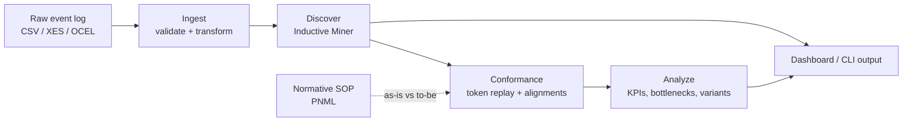

# Algorithmic Process Mining

[](https://github.com/Ashok007-cmd/algorithmic-process-mining/actions/workflows/ci.yml)
[](docs/AUDIT_REPORT.md)
[](docs/AUDIT_REPORT.md)
[](docs/AUDIT_REPORT.md)
[](pyproject.toml)
[](LICENSE)

A production-shaped **process mining and conformance checking pipeline** for logistics event logs (Order-to-Cash / Procure-to-Pay). It answers the two questions every business process analyst is actually asked: *"what is our process really doing?"* and *"how far is that from what it's supposed to do?"* — algorithmically, from event data, not from a whiteboard.

Given a raw event log (case ID + activity + timestamp — the same shape SAP/Oracle ERP audit trails export), it discovers the actual process model, measures conformance against a documented SOP, and quantifies bottlenecks, rework loops, and cycle time — as a scriptable CLI pipeline or an interactive dashboard.

## Why this exists

Manually-mapped process diagrams describe what someone *believes* the process is. Process mining discovers what it *actually is*, from the system-of-record's own event trail — including the shadow processes, skipped approvals, and rework loops that never make it onto a whiteboard. This project implements that discipline end-to-end:

- **Discovery** — Inductive Miner (`pm4py`) reconstructs a sound Petri net from raw events, with `im`/`imf`/`imd` variants trading off precision vs. speed on larger logs.
- **Conformance checking** — every case is measured against a normative "to-be" SOP model via both token-based replay (fast, diagnostic) and alignments (precise, cost-based), so you get a real fitness score instead of a subjective compliance guess.
- **Root-cause analytics** — bottleneck detection (which activity is actually slow, and by how much), rework detection (which steps get repeated), and variant analysis (how many distinct paths through the process actually exist, and what share follows the happy path).
- **Object-centric support (OCEL 2.0)** — for processes where a single case ID isn't enough (e.g., one order touching multiple deliveries and invoices).

## What it does

1. **Ingest** a CSV/XES/Parquet event log, validate it (schema, timestamps, duplicates), and optionally anonymize case IDs.
2. **Discover** a Petri net process model with the Inductive Miner (`im` / `imf` / `imd` variants).
3. **Check conformance** — either self-conformance (as-discovered) or against a normative SOP model (as-is vs to-be), via both token-based replay and alignments.
4. **Analyze** cycle time, throughput bottlenecks, rework loops, and trace variants.
5. **Visualize** everything in a Streamlit dashboard, or drive it all from the CLI for batch/automated use.



## Quickstart

```bash
python3 -m venv .venv
source .venv/bin/activate
pip install -e ".[dev]"

# system dependency for Petri net / DFG rendering
sudo apt-get install -y graphviz   # or: make setup-graphviz
```

Generate a synthetic log and run it through the pipeline:

```bash
python -m src.cli generate --process o2c --cases 100 --noise 0.2 --output data/raw/o2c.csv
python -m src.cli run --input data/raw/o2c.csv --output data/processed/o2c_clean.csv
python -m src.cli discover --input data/processed/o2c_clean.csv --output data/models/o2c_model.pnml
python -m src.cli conformance --input data/processed/o2c_clean.csv --output data/results/o2c_conformance.json
```

Or launch the interactive dashboard:

```bash
streamlit run src/viz/dashboard.py
```

## CLI reference

| Command | Purpose |
|---|---|
| `generate --process {o2c,p2p} --cases N [--noise F] [--seed N] --output PATH` | Generate a synthetic O2C/P2P event log with controllable noise (skips, rework, insertions) |
| `run --input PATH --output PATH [--anonymize] [--salt S] [--config PATH]` | Load, validate, transform, and (optionally) anonymize an event log |
| `discover --input PATH --output PATH [--variant {im,imf,imd}] [--noise-threshold F]` | Discover a Petri net (PNML) with the Inductive Miner |
| `conformance --input PATH --output PATH [--model PATH]` | Compare a log against a normative model (default `data/normative/o2c_sop.pnml`) via token replay + alignments; falls back to self-discovery if no model is given |

All commands accept `--config PATH` to override `config.yaml`. Run `python -m src.cli <command> --help` for full option lists.

## Configuration

Runtime defaults live in [`config.yaml`](config.yaml): data paths and column mapping, discovery algorithm/variant/noise threshold, conformance model path, analysis thresholds (bottleneck percentile, top-N variants), and visualization limits. `src/config.py` loads it into typed dataclasses; CLI commands and the dashboard both read from it, and any command's `--config` flag can point at an alternate file.

Environment variables (see `.env.example`):

| Variable | Purpose |
|---|---|
| `ANONYMIZER_SALT` | Salt for hashing case IDs when anonymizing — set this in any real (non-demo) use, or a warning is logged |
| `LOG_LEVEL` | Logging verbosity (default `INFO`) |
| `PROJECT_ROOT`, `DATA_DIR`, `PM4PY_CACHE_DIR` | Optional path overrides |

## Project structure

```
src/
├── cli.py                  # generate / run / discover / conformance subcommands
├── config.py                # config.yaml + .env loader
├── data/
│   ├── loader.py             # CSV / XES / Parquet ingestion
│   ├── validator.py          # schema, timestamp, duplicate checks
│   ├── transformer.py        # column mapping, dtype casting, UTC normalization
│   ├── anonymizer.py         # salted case-ID hashing
│   ├── pipeline.py           # load -> transform -> validate -> (anonymize)
│   ├── generators/synthetic.py  # synthetic O2C/P2P log generator (noise, rework, skips)
│   └── ocel/                 # object-centric event log (OCEL 2.0) loading
├── discovery/
│   ├── inductive.py           # Inductive Miner (im / imf / imd variants), LRU-cached
│   ├── heuristics.py          # Heuristics Miner
│   └── dfg.py                 # Directly-Follows Graph + DFG-based Petri net
├── conformance/
│   ├── token_replay.py        # token-based replay fitness
│   ├── alignments.py          # alignment-based fitness (with cost-bounding sample cap)
│   └── comparison.py          # method comparison + as-is vs to-be normative comparison
├── analysis/
│   ├── kpis.py                 # cycle time / throughput
│   ├── bottlenecks.py          # slow-activity + rework detection
│   └── variants.py             # trace variant frequency, happy-path share
├── viz/
│   ├── dashboard.py            # Streamlit app
│   ├── charts.py               # Plotly chart components
│   └── petri_render.py         # Petri net / DFG / heuristics net rendering (graceful Graphviz fallback)
└── utils/                   # logging, file-path validation, discovery-result caching, CSV-injection sanitization

data/
├── normative/    # SOP ("to-be") Petri nets — o2c_sop.pnml, p2p_sop.pnml
├── sample/       # small example logs
├── raw/ processed/ models/ results/ ocel/   # pipeline working directories (gitignored)

docs/
└── AUDIT_REPORT.md   # improvement analysis + full security/vulnerability audit (see below)

tests/            # pytest suite mirroring src/, plus integration + CLI e2e tests
```

## Development

```bash
make install-dev     # pip install -e ".[dev]"
make test            # pytest
make test-cov        # pytest with coverage report
make lint             # ruff check
make format           # ruff format
make typecheck        # mypy --strict
make run-app          # streamlit dashboard
```

The test suite covers ingestion, discovery, conformance, analysis, caching, CLI commands, and OCEL loading (**125 tests, 89% coverage** on `src/`). CI (`.github/workflows/ci.yml`) runs ruff, ruff format check, mypy --strict, bandit, pip-audit, and the full pytest matrix (3.11/3.12) on every push/PR.

## Security

This project has been through a full audit: static analysis (bandit, mypy --strict), dependency vulnerability scanning (pip-audit, with 2 real CVEs found and patched), supply-chain legitimacy verification of all 101 packages in the dependency tree, a first-party code-integrity review, and authorized adversarial testing of the CLI (including a confirmed-and-fixed CSV formula injection vulnerability). Full methodology and findings: **[docs/AUDIT_REPORT.md](docs/AUDIT_REPORT.md)**.

## Docker

```bash
docker build -t process-mining .
docker run -p 8501:8501 process-mining
```

Runs as a non-root user with a container healthcheck against Streamlit's `/_stcore/health` endpoint. The image binds the dashboard to all interfaces with no built-in authentication — put a reverse proxy with TLS/auth in front of it before exposing it beyond a trusted network.

## Notes

- `pm4py` is licensed AGPL v3 (Community Edition) — commercial use without a commercial pm4py license requires open-sourcing applications built on it. This project's own code is MIT-licensed (see [LICENSE](LICENSE)); see the [pm4py licensing page](https://processintelligence.solutions/pm4py#licensing) for pm4py's own terms.
- Petri net / DFG rendering requires the system `graphviz` package (the `dot` binary); if it isn't installed, rendering raises a clear `VisualizationUnavailableError` instead of crashing, and the dashboard shows an informational message.
- The normative SOP models in `data/normative/` were discovered from each process's clean happy-path sequence (see `src/data/generators/synthetic.py`) — replace them with your own PNML files to check conformance against a real organizational SOP.
